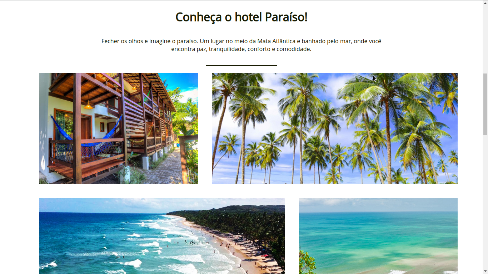

# [Flex-Box CSS](https://eudavidreis-odev.github.io/exemplo-flex-box/)

Este projeto é um exemplo do uso da propriedade display:flex do CSS, e utiliza apenas HTML e CSS em sua construção. Todas as informações e imagens usadas aqui são meramente ilustrativas.
 Neste [link](https://www.youtube.com/watch?v=KIKekNqq3so&list=PLwXQLZ3FdTVGjLmjwfRc0Q9TA5U-PCWp4) você pode acessar o mesmo tutorial em vídeo que usei para realizar este projeto, assim como pode fazer o download dele pronto a partir deste repositório.

## [Pré-visualização](https://eudavidreis-odev.github.io/exemplo-flex-box/)

Aqui esta uma demonstração do resultado alcançado. Com foco principal nas imagens que usam a propriedade flex para controlar e exibição das mesmas, evitando quebra de layout e garantindo responsividade. Neste [link](https://eudavidreis-odev.github.io/exemplo-flex-box/) você pode visualizar o site na integra.

